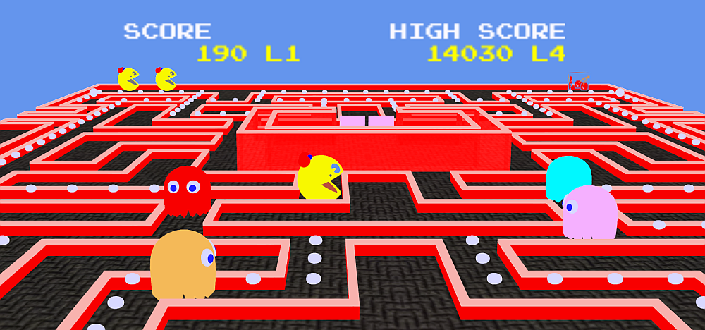
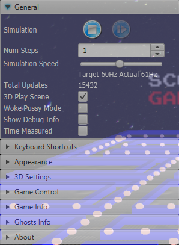
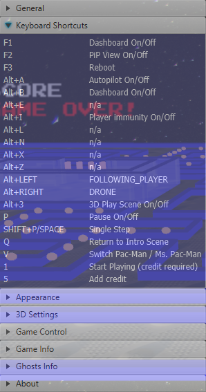
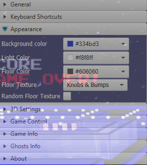
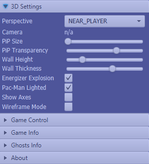
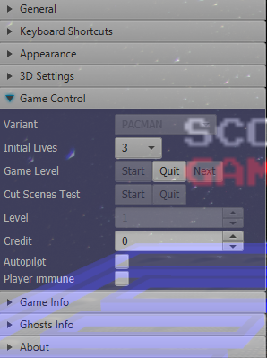
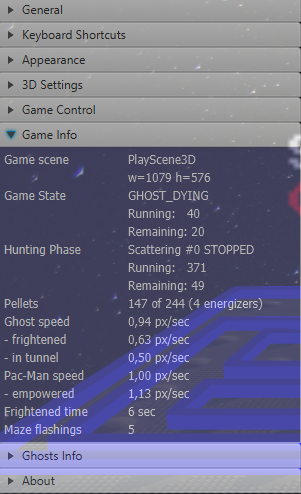
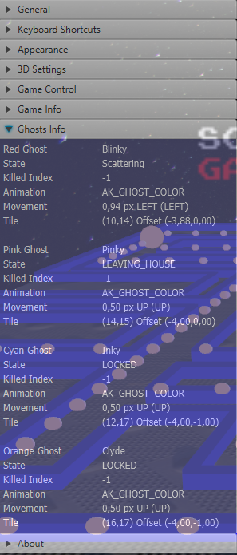
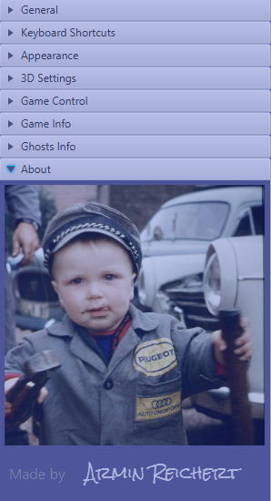

# A JavaFX UI (2D + 3D) for Pac-Man and Ms. Pac-Man

## ℹ️ Online version available

Both games (2D) can now also be played online:

- [GitHub](https://armin-reichert.github.io/webfx-pacman/)
- [WebFX Demo Pac-Man](https://pacman.webfx.dev/)
- [WebFX Demo Ms. Pac-Man](https://mspacman.webfx.dev/)

This has been made possible thanks to the [WebFX](https://webfx.dev/) transpiler technology (👏 to Bruno Salmon).

## Video

## About this project

JavaFX user interfaces for my
UI-agnostic/faceless [Pac-Man and Ms. Pac-Man games](https://github.com/armin-reichert/pacman-basic). There is a 2D-only
user interface and
a full version where the play scene can be switched between 2D and 3D, even during the gameplay (key combination <kbd>
Alt+3</kbd>).

## How to run

In each [release](https://github.com/armin-reichert/pacman-javafx/releases) you find attached 3 installers. 

On Windows, the application must be uninstalled first (if already installed), otherwise the installer crashes (no idea why).

The Linux (.deb) installer has only been tested on Ubuntu inside a VM, it worked after installing the FFMPeg library (see [linux-issues.md](linux-issues.md)).

The Mac-OS (.dmg) version has not been tested at all, any help is appreciated.

## How to build

You need to have a [JDK 21](https://www.oracle.com/java/technologies/downloads/#java21) installed on your computer.

### Clone repository (only first time)

- `cd /whatever/path/to/your/repositories`
- `git clone https://github.com/armin-reichert/pacman-javafx.git`

## Build project with Gradle

- `cd pacman-javafx`
- `./gradlew jpackage`: create installers in directories `pacman-ui-fx-2d/build/jpackage` and `pacman-ui-fx-3d/build/jpackage`

(Note: Using `clean jpackage` always fails because the old exe-files cannot be deleted, see https://github.com/gradle/gradle/issues/26912). Manually deleting the build folder or clearing the exe-file's read-only flag helps)

### Running the application(s) using Gradle

- 2D app: `./gradlew pacman-ui-fx-2d:run`
- 3D app: `./gradlew pacman-ui-fx-3d:run`

## Build project with Maven

### Build Windows installers for both variants (2D and 3D)

- `cd /whatever/path/to/your/repositories/pacman-javafx`
- `./mvnw clean install -Pbuild-for-windows`

### Build user interface variants separately

- `cd /whatever/path/to/your/repositories/pacman-javafx/pacman-ui-fx-2d`
- `../mvnw install -Djavafx.platform=win`   or `mvnw install -P build-for-windows` (Windows executables of 2D game)

- `cd /whatever/path/to/your/repositories/pacman-javafx/pacman-ui-fx-3d`
- `../mvnw install -Djavafx.platform=win`   or `mvnw install -P build-for-windows` (Windows executables of 2D+3D game)

To be able to create the Windows executables, you need to first install the following tools:

- [Inno Setup](https://jrsoftware.org/isinfo.php)
- [WiX toolset](https://wixtoolset.org/)

as described in
the [JavaPackager guide](https://github.com/fvarrui/JavaPackager/blob/master/docs/windows-tools-guide.md)
(👏: to [Francisco Vargas Ruiz](https://github.com/fvarrui)).

I also had to add the paths "C:\Program Files (x86)\WiX Toolset v3.11\bin" and "C:\Program Files (x86)\Inno Setup 6" to my PATH variable.

### Running the application(s) using Maven

In the 2D or 3D subproject folder, call `..\mvnw javafx:run`.

## How to use the application

Starting the game and switching game variant:

- <kbd>V</kbd> Switch between Pac-Man and Ms. Pac-Man (only possible on intro screen)
- <kbd>5</kbd> Add credit ("insert coin")
- <kbd>1</kbd> Start game
- <kbd>H</kbd>Show/hide context-sensitive help

Pac-Man steering:

- Pac-Man is steered using the cursor keys. When the dashboard is open, these keys are taken away by the JavaFX widgets.
  In that case, you can steer Pac-Man using key combination <kbd>CTRL</kbd>+cursor key.

General shortcuts:

- <kbd>F11</kbd> Enter full-screen mode
- <kbd>Esc</kbd> Exit full-screen mode
- <kbd>F1</kbd> or <kbd>Alt+B</kbd> Toggle dashboard
- <kbd>F2</kbd> Toggle picture-in-picture view
- <kbd>Alt+C</kbd> Play all intermission/cut scenes
- <kbd>Alt+3</kbd> Toggle using 2D/3D play scene

Play screen shortcuts:

- <kbd>Alt+LEFT</kbd> Select previous camera perspective
- <kbd>Alt+RIGHT</kbd> Select next camera perspective
- <kbd>Q</kbd>Quit play scene and show intro screen

Cheats:

- <kbd>Alt+A</kbd> Toggle autopilot mode
- <kbd>Alt+E</kbd> Eat all pills except the energizers
- <kbd>Alt+I</kbd> Toggle immunity of player against ghost attacks
- <kbd>Alt+L</kbd> Add 3 player lives
- <kbd>Alt+N</kbd> Enter next game level
- <kbd>Alt+X</kbd> Kill all ghosts outside of the ghosthouse

## How it looks

### 3D Play Scene

### Dashboard

