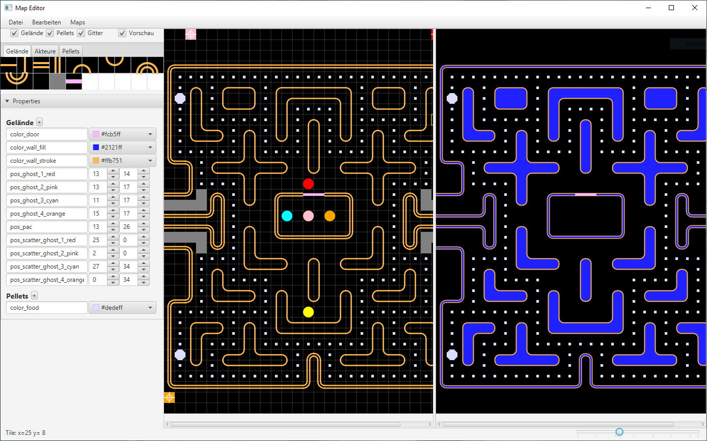

# A JavaFX UI (2D + 3D) for Pac-Man and Ms. Pac-Man

## ℹ️ Online version available

Both games (2D) can now also be played online:

- [GitHub](https://armin-reichert.github.io/webfx-pacman/)
- [WebFX Demo Pac-Man](https://pacman.webfx.dev/)
- [WebFX Demo Ms. Pac-Man](https://mspacman.webfx.dev/)

This has been made possible thanks to the [WebFX](https://webfx.dev/) transpiler technology (👏 to Bruno Salmon).

## Videos

    
    

## About this project

This is an implementation of the classic Arcade games Pac-Man and Ms. Pac-Man in a JavaFX user interface. The game implementation is completely decoupled from the user interface such that also different user interfaces (e.g. a Swing UI) can be implemented without any change to the game code. (When developing the game, I originally maintained a Swing and a JavaFX UI in parallel to validate the UI abstraction, however the Swing UI got outdated and has been abandonded.)

There is a 2D-only user interface version and an extended version where the play scene can be switched between 2D and 3D, even during the gameplay (key combination <kbd>
Alt+3</kbd>). The game implementation tries to mimic the original Arcade version as good as possible, however there are some differences, e.g. in the "attract mode" behaviour, or the bonus behaviour in the Ms. Pac-Man game.

## How to run

In each [release](https://github.com/armin-reichert/pacman-javafx/releases) you find attached 3 installers. 

On Windows, the application must be uninstalled first (if already installed), otherwise the installer crashes (no idea why).

The Linux (.deb) installer has only been tested on Ubuntu inside a VM, it worked after installing the FFMPeg library (see [linux-issues.md](linux-issues.md)).

The Mac-OS (.dmg) version has not been tested at all, any help is appreciated.

## How to build

Prerequisites: You need to have [JDK 21](https://www.oracle.com/java/technologies/downloads/#java21) and [Git](https://github.com/git-guides/install-git) installed on your computer.

### Cloning the GitHub repository

- `cd /whatever/path/to/your/repositories`
- `git clone https://github.com/armin-reichert/pacman-javafx.git`

## Building with Gradle

- `cd pacman-javafx`
- `./gradlew jpackage`

This will create installers in the subdirectories `pacman-ui-fx-2d/build/jpackage` and `pacman-ui-fx-3d/build/jpackage`.

(Note: On Windows, `gradlew clean jpackage` always fails because the old exe-files cannot be deleted, see https://github.com/gradle/gradle/issues/26912). Manually deleting the build folder or clearing the exe-file's read-only flag helps.)

### Running the application(s) using Gradle

- Pac-Man 2D: `./gradlew pacman-ui-fx-2d:run`
- Pac-Man 3D: `./gradlew pacman-ui-fx-3d:run`

## Building with Maven

### Building Windows installers (.exe)

- `cd /whatever/path/to/your/repositories/pacman-javafx`
- `./mvnw clean install -Pbuild-for-windows`

### Build 2D and 3D user interface variants separately

- `cd /whatever/path/to/your/repositories/pacman-javafx/pacman-ui-fx-2d`
- `../mvnw install -Djavafx.platform=win` or `mvnw install -P build-for-windows` (Windows executables of 2D game)

- `cd /whatever/path/to/your/repositories/pacman-javafx/pacman-ui-fx-3d`
- `../mvnw install -Djavafx.platform=win` or `mvnw install -P build-for-windows` (Windows executables of 2D+3D game)

To be able to create the Windows executables, you need to have the following tools installed:

- [Inno Setup](https://jrsoftware.org/isinfo.php)
- [WiX toolset](https://wixtoolset.org/)

as described in the [JavaPackager guide](https://github.com/fvarrui/JavaPackager/blob/master/docs/windows-tools-guide.md)
(👏 to [Francisco Vargas Ruiz](https://github.com/fvarrui)).

I also had to add the paths "C:\Program Files (x86)\WiX Toolset v3.11\bin" and "C:\Program Files (x86)\Inno Setup 6" to my PATH variable.

### Running the application(s) using Maven

In the 2D or 3D subproject folder, call `..\mvnw javafx:run`.

## How to use the application

Start screen:
- <kbd>V</kbd> Switches between Pac-Man and Ms. Pac-Man

Intro screen:
- <kbd>5</kbd> Adds one credit ("inserts coin")
- <kbd>1</kbd> Starts the game
- <kbd>H</kbd>Shows/hides context-sensitive help

The keys <kbd>5</kbd> and <kbd>1</kbd> have been chosen because the [MAME](https://www.mamedev.org/) emulator uses them too.

Pac-Man steering with the keyboard:

- Pac-Man is steered using the *cursor keys*. When the dashboard is open (in the 3D app version), these keys are taken away by the JavaFX widgets.
  In that case, you can use <kbd>CTRL</kbd>+cursor key.

General shortcuts:

- <kbd>F11</kbd> Enters full-screen mode
- <kbd>Esc</kbd> Exits full-screen mode
- <kbd>F1</kbd> or <kbd>Alt+B</kbd> Toggles the dashboard on/off
- <kbd>F2</kbd> Toggles the picture-in-picture view
- <kbd>Alt+C</kbd> Plays all cut scenes (only from intro screen)
- <kbd>Alt+3</kbd> Toggles between 2D and 3D play scene

Play screen shortcuts:

- <kbd>Alt+LEFT</kbd> Selects the previous camera perspective
- <kbd>Alt+RIGHT</kbd> Selects the next camera perspective
- <kbd>Q</kbd>Quits the play scene and shows the intro screen

Cheats:

- <kbd>Alt+A</kbd> Toggles manual/autopilot steering modes
- <kbd>Alt+E</kbd> Eats all pellets (except the energizers)
- <kbd>Alt+I</kbd> Toggles immunity of player against ghost attacks
- <kbd>Alt+L</kbd> Adds 3 player lives
- <kbd>Alt+N</kbd> Enters next game level
- <kbd>Alt+X</kbd> Kills all ghosts outside of the ghost house

## How it looks

### 3D Play Scene

### The tile map editor

