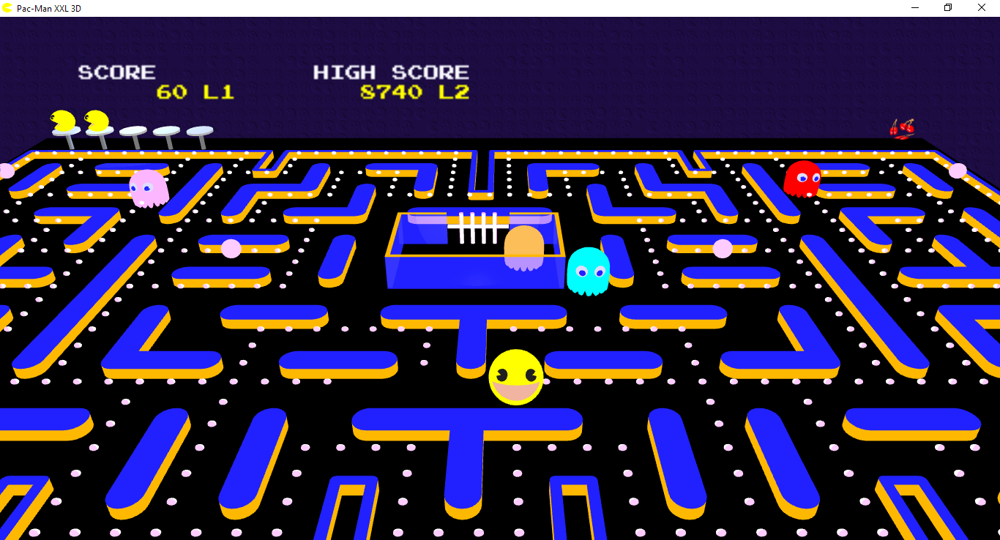
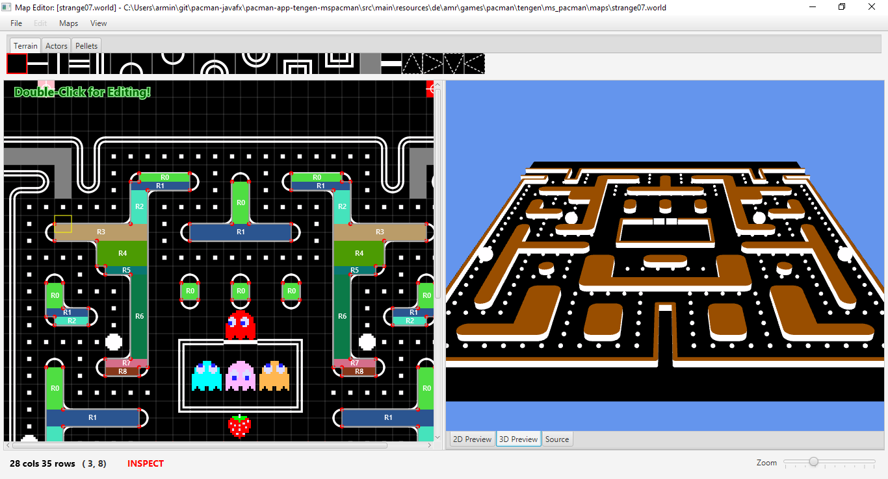

# A JavaFX remake (2D+3D) of Pac-Man (Arcade) and Ms. Pac-Man (Arcade + Tengen NES Version)

## ℹ️ Online version available

An older release of Pac-Man and Ms. Pac-Man (2D) can be played online:

- [GitHub](https://armin-reichert.github.io/webfx-pacman/)
- [WebFX Demo Pac-Man](https://pacman.webfx.dev/)
- [WebFX Demo Ms. Pac-Man](https://mspacman.webfx.dev/)

This has been made possible thanks to the [WebFX](https://webfx.dev/) transpiler technology (👏 to Bruno Salmon).

## About this project

This is an implementation of the classic Arcade games Pac-Man and Ms. Pac-Man and the NES version of Ms. Pac-Man by Tengen in a JavaFX user interface. 

The user interface can be switched between 2D and 3D, even during the gameplay (key combination <kbd>Alt+3</kbd>). The game implementation tries to mimic the original Arcade version as good as possible, however there are some differences, e.g. in the "attract mode" behaviour, or the bonus behaviour in the Ms. Pac-Man game.

The game also contains a game variant (working title "Pac-Man XXL") with 8 different Arcade-like maps (shamelessly stolen from the one and only Shaun Williams 👏, https://github.com/masonicGIT/pacman). To integrate these maps, I implemented a map editor that can either be used as a standalone application or called from within the XXL version of the game). All these maps and all your custom maps are playable in 2D and in 3D! 

### How to use custom maps in PacMan XXL

When using the map editor to create your own maps, you don't have to specify any graphics assets!. Colors, tunnel and actor positions can be specified using map properties inside the editor. Store the `.world` file inside folder `$user_home/.pacmanfx/maps`. In the option menu of the Pac-Man XXL variant, you can select if your custom maps are selected first or randomly shuffled with the 8 builtin maps.

## How to run

In each [release](https://github.com/armin-reichert/pacman-javafx/releases) you find attached 3 installers. 

- On Windows, a MSI installer is created. 
- The Linux (.deb) installer has only been tested inside a VM. On a fresh installation of Zorin 18 in VMWare Workstation 17 Player, the game runs out-of-the box. (See [linux-issues.md](doc/linux-issues.md) for issues I had with an older Ubuntu system). Note that the program is installed in folder `/opt/pac-man-fx-3d/bin`. Probably there is some better way, but honestly I don't have much motivation to find that out. 
- The Mac-OS (.dmg) version has not been tested at all, any help is appreciated.

## How to build

Prerequisites: You need to have a Java 25 compiler and [Git](https://github.com/git-guides/install-git) installed on your computer.

- `git clone https://github.com/armin-reichert/pacman-javafx.git`
- `cd pacman-javafx`
- `./gradlew jpackage` or `./gradlew clean jpackage` (clean build)
- On Windows, you can also call
  - `make` or `make clean`
- and on Linux
  - `./make.sh` or `./make.sh clean`

On Linux (Ubuntu 24), I first had to install also
- binutils: `sudo apt-get install binutils`
- fakeroot: `sudo apt-get install fakeroot`
  
This will create
- an installer (.msi, .deb, or .dmg, depending on your platform) for the app containing all game variants (subdirectory `pacman-ui-3d-app-allgames/build/jpackage`)
- an installer for the map editor (subdirectory `pacman-app-mapeditor/build/jpackage`)

To be able to create the Windows executables, you need to have the following tools installed:

- [Inno Setup](https://jrsoftware.org/isinfo.php)
- [WiX toolset 3.14]([https://wixtoolset.org/](https://github.com/wixtoolset/wix3/releases/tag/wix3141rtm)) 
  (JDK 25 with WiX versions 4 or 5 does not work!)

as described in the [JavaPackager guide](https://github.com/fvarrui/JavaPackager/blob/master/docs/windows-tools-guide.md)
(👏 to [Francisco Vargas Ruiz](https://github.com/fvarrui)).

I also had to add the paths "C:\Program Files (x86)\WiX Toolset v3.11\bin" and "C:\Program Files (x86)\Inno Setup 6" to my PATH variable.

### Running the application (including all games) using Gradle

- All-game-variants app: `gradlew pacman-app-allgames:run`
- Map Editor: `gradlew pacman-app-mapeditor:run`

## How to use the application

Start screen:
- <kbd>V</kbd>, <kbd>LEFT</kbd> Select next game variant
- <kbd>RIGHT</kbd> Select previous game variant
- <kbd>ENTER</kbd> or <kbd>SPACE</kbd> Start game 

Intro screen:
- <kbd>5</kbd> Add credit ("insert coin")
- <kbd>1</kbd> Start the game
- <kbd>H</kbd> Show/hide context-sensitive help

The keys <kbd>5</kbd> and <kbd>1</kbd> have been chosen because the [MAME](https://www.mamedev.org/) emulator uses them too.

Pac-Man steering:

- Pac-Man is steered using the *cursor keys*. When the dashboard is open, the cursor keys might also change slider values etc. To avoid this, you can also steer using <kbd>CTRL</kbd>+cursor key.

General shortcuts:

- <kbd>F11</kbd> Enter full-screen mode
- <kbd>Esc</kbd> Exit full-screen mode
- <kbd>Alt+3</kbd> Toggle 2D and 3D display of play scene
- <kbd>Q</kbd>Quit current scene and show start screen
- <kbd>Alt+M</kbd> Mute/unmute

Intro screen shortcuts:

- <kbd>Alt+C</kbd> Play the cut scenes

Play screen shortcuts:

- <kbd>F1</kbd> or <kbd>Alt+B</kbd> Toggle the dashboard display
- <kbd>F2</kbd> Toggle the picture-in-picture view
- <kbd>Alt+Shift+E</kbd> Open the Map Editor
- <kbd>Alt+LEFT</kbd> Select previous camera perspective
- <kbd>Alt+RIGHT</kbd> Select next camera perspective

Cheats:

- <kbd>Alt+A</kbd> Toggle manual/autopilot steering mode
- <kbd>Alt+E</kbd> Eat all pellets (except the energizers)
- <kbd>Alt+I</kbd> Toggle immunity of player against ghost attacks
- <kbd>Alt+L</kbd> Add 3 player lives
- <kbd>Alt+N</kbd> Enter next game level
- <kbd>Alt+X</kbd> Kill all ghosts outside of the ghost house

## How it looks (Click to play video)

    

There are some new videos about the different game variants available on [YouTube](https://www.youtube.com/channel/UCARNko9I75M8XQsmepFi4CA) (despite I hate that platform for their censorship practices).

### 2D Play Scenes

#### Pac-Man

#### Ms. Pac-Man (Arcade)

#### Pac-Man XXL

#### Ms. Pac-Man (Tengen)

### 3D Play Scenes

#### Pac-Man

#### Pac-Man XXL Standard Map

#### Pac-Man XXL Custom Map

#### Ms. Pac-Man (Arcade)

### Ms. Pac-Man (Tengen)

### Tile map editor

